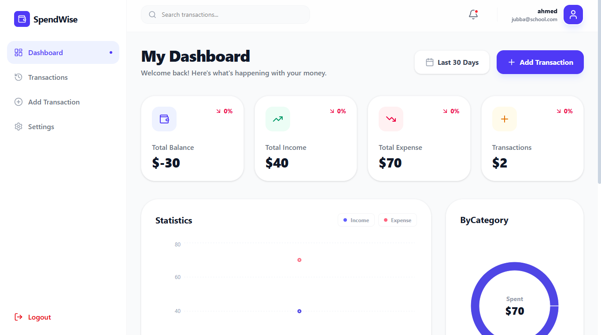

# 💰 Expense Tracker - Personal Finance Dashboard

[](https://react.dev/)
[](https://vitejs.dev/)
[](https://tailwindcss.com/)
[](https://nodejs.org/)
[](https://www.mongodb.com/)
[](LICENSE)

<p align="center">
  
</p>

## 🌟 Overview

**Expense Tracker** is a modern, full-stack financial management application designed to help individuals track their spending, manage budgets, and visualize their financial health with precision and ease. Built with the **MERN stack**, it offers a seamless, responsive, and secure experience.

---

## ✨ Key Features

- **📊 Dynamic Dashboard**: Real-time visualization of income vs. expenses using interactive charts.
- **💸 Transaction Management**: Easily add, edit, and delete transactions with categorized tags.
- **🔐 Secure Authentication**: Robust user authentication using JWT and bcrypt password hashing.
- **📱 Responsive Design**: Fully optimized for mobile, tablet, and desktop views using Tailwind CSS 4.
- **📅 Data Filtering**: Filter transactions by date range, category, or type.
- **🎭 Smooth Animations**: Enhanced user experience with Framer Motion transitions.

---

## 🛠️ Tech Stack

### Frontend
- **React 19**: Modern UI development with hooks.
- **Vite 7**: Ultra-fast build tool and development server.
- **Tailwind CSS 4**: Utility-first styling with the latest features.
- **Recharts**: For elegant and responsive data visualization.
- **Framer Motion**: For smooth, declarative animations.
- **Lucide React**: For beautiful, consistent iconography.

### Backend
- **Node.js & Express 5**: Fast and scalable server-side environment.
- **MongoDB & Mongoose 9**: Flexible NoSQL database with powerful schema modeling.
- **JWT**: Secure token-based authentication.

---

## 🚀 Getting Started

### Prerequisites
- Node.js (v18+)
- MongoDB (Local or Atlas)

### Installation

1. **Clone the repository:**
   ```bash
   git clone https://github.com/0paziz/SpendWise_MERN-Stack.git
   cd expense-tracker
   ```

2. **Frontend Setup:**
   ```bash
   cd frontend
   npm install
   cp .env.example .env # Update your variables
   npm run dev
   ```

3. **Backend Setup:**
   ```bash
   cd ../backend
   npm install
   cp .env.example .env # Update your variables
   node server.js
   ```

---

## 🤝 Contributor Pledge

We as members, contributors, and leaders pledge to make participation in our community a harassment-free experience for everyone, regardless of age, body size, visible or invisible disability, ethnicity, sex characteristics, gender identity and expression, level of experience, education, socio-economic status, nationality, personal appearance, race, religion, or sexual identity and orientation.

We commit to acting and interacting in ways that contribute to an open, welcoming, diverse, inclusive, and healthy community.

### 🔒 Privacy & Security Pledge
We pledge to handle user financial data with the utmost care. This project follows industry best practices for security:
- **Zero Raw Passwords**: All passwords are hashed using Bcrypt.
- **Data Privacy**: We do not sell or share user data.
- **Secure Sessions**: Authentication is handled via secure, stateless JSON Web Tokens.

---

## 📜 License


This project is licensed under the MIT License - see the [LICENSE](LICENSE) file for details.

---

<p align="center">
  Built with ❤️ by Abdiaziz
</p>
